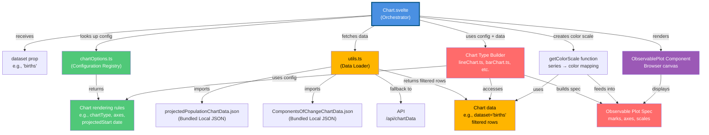

# Chart.svelte Architecture and Data Flow

## How it Works:

1. **Chart.svelte (blue center)** receives a `dataset` prop (like `"births"`)
2. **Looks up config** in `chartOptions.ts` to get rendering rules (chart type, axes, projected start date)
3. **Fetches data** via `utils.ts` which:
   - Checks bundled JSON files first (local-first)
   - Falls back to API if dataset not found locally
   - Returns filtered rows for that specific dataset
4. **Constructs visualization** using the appropriate chart builder (lineChart.ts, barChart.ts, etc.)
5. **Creates color scale** mapping series names to colors
6. **Builds Observable Plot spec** combining all the marks, axes, and scales
7. **Renders to browser** via ObservablePlot component
