# End-to-End Data Flow: From Source to Browser

```mermaid
graph LR
    A["Raw Parquet Files<br/>births, deaths, migration"]
    B["preprocessComponents.py<br/>(Data Pipeline)"]
    C["ComponentsOfChangeChartData.json<br/>Long-format JSON"]
    D["web/src/lib/data/<br/>(Bundled with app)"]
    E["utils.ts loadChartData<br/>(filter by dataset name)"]
    F["Chart.svelte data prop<br/>(filtered rows)"]
    G["lineChart.ts<br/>or barChart.ts"]
    H["ObservablePlot Spec"]
    I["Browser Canvas<br/>Rendered Chart"]
    
    A -->|reads| B
    B -->|writes| C
    C -->|imported as| D
    D -->|loaded by| E
    E -->|filters| F
    F -->|passed to| G
    G -->|outputs| H
    H -->|renders as| I
    
    style A fill:#E8F5E9
    style B fill:#FFF3E0
    style C fill:#E3F2FD
    style D fill:#E3F2FD
    style E fill:#FCE4EC
    style F fill:#F3E5F5
    style G fill:#FFE0B2
    style H fill:#FFE0B2
    style I fill:#A5D6A7
```

## Data Journey:

1. **Raw Parquet Files** in `/Downloads/output_pq/` contain births, deaths, migration data
2. **preprocessComponents.py** (Python script) reads these files
3. **Transforms to JSON** (ComponentsOfChangeChartData.json) in long-format: `{ dataset, xd, b, y }`
4. **Shipped with app** as bundled static asset in `web/src/lib/data/`
5. **utils.ts** loads the JSON at runtime, filters by dataset name
6. **Chart.svelte** receives filtered dataset
7. **Chart builder** (lineChart.ts, barChart.ts, etc.) transforms data into Observable Plot spec
8. **ObservablePlot** renders the spec to a canvas in the browser
